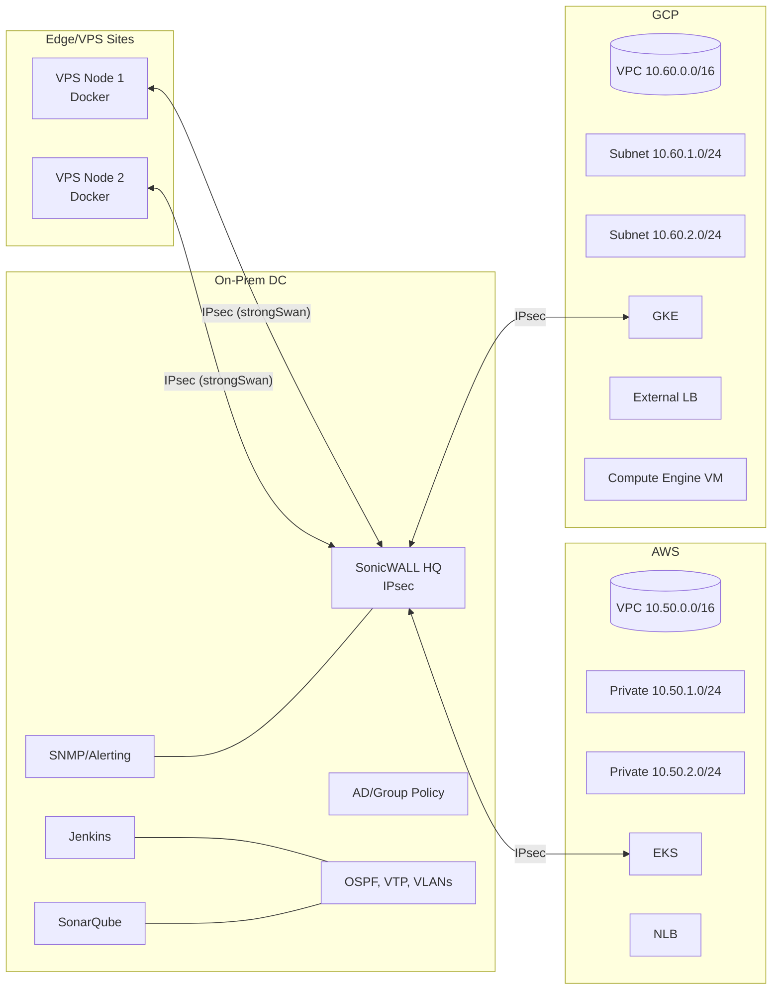

# Edge + VPS Hybrid over IPsec (On‑Prem + VPS + AWS/GCP)

What We Deployed
- Edge/VPS: Dockerized apps on 2+ VPS nodes (e.g., Hetzner/Linode) connected to HQ over IPsec (strongSwan on VPS ↔ SonicWALL at HQ).
- On‑prem: SonicWALL firewall, AD/Group Policy, OSPF/VTP/VLAN segmentation, NAT/ACLs.
- Cloud: Small EKS and GKE clusters for core services, with External LBs; GCP Compute Engine VM for specific hybrid workloads.
- CI/CD: Jenkins builds, SonarQube scanning, blue/green deploys to edge and cloud targets.
- Monitoring: SNMP exporter for SonicWALL, node exporters on VPS, alert-driven failover.

Why We’re Using This
- Meet edge latency needs at branches or customer sites via nearby VPS.
- Keep sensitive systems on‑prem while bursting to cloud for scalability.
- Reuse existing SonicWALL/IPsec skills for hybrid and edge without SD‑WAN.

How We’re Saving Money
- VPS for edge workloads are low-cost; use cloud only for scale-out bursts.
- Spot/Preemptible pools for K8s; schedule CI/Sonar off-hours; consolidate NAT/LBs.
- Right-size edge nodes and container resources; compress and batch data to reduce egress.

Architecture Diagram (Mermaid)

Repo Structure (minimal scaffold)
- `edge/` — Compose files and deployment scripts for VPS nodes
- `k8s/` — Overlays for EKS/GKE targets
- `ci/` — Jenkinsfile and smoke tests
- `network/` — strongSwan and SonicWALL examples
- `docker/app/` — Edge-ready demo service

Quick Links
- Problem Statement: `edge-vps-hybrid-ipsec/PROBLEM_STATEMENT.md`
- Architecture Diagram (PNG): `edge-vps-hybrid-ipsec/docs/diagrams/topology.png`
- Diagram Viewer (HTML): `edge-vps-hybrid-ipsec/docs/diagrams/index.html`

Costs
- Initial (ballpark): ~$520/mo (VPS x2 small, EKS/GKE min nodes, 2 LBs, VPN)
- Optimized (ballpark): ~$220/mo (preemptible/spot nodes, off-hours CI, tuned LBs)
- Savings via low-cost VPS for edge + cloud autoscaling with Spot/Preemptible; minimal LB count; scale-to-zero off-hours.
