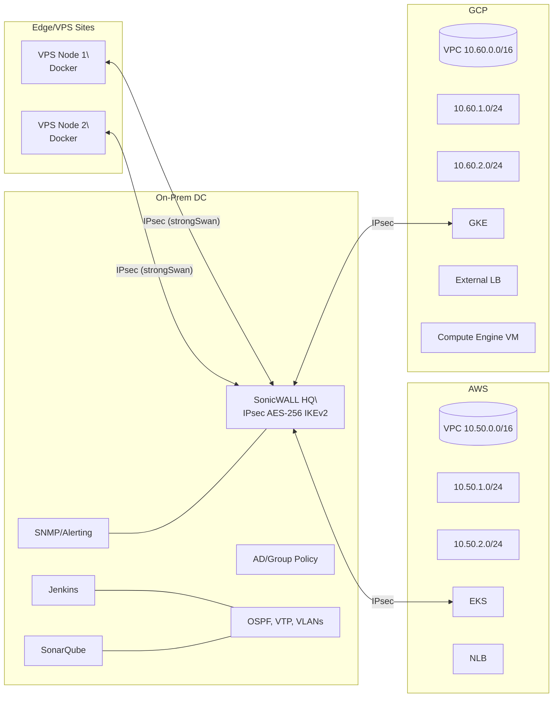
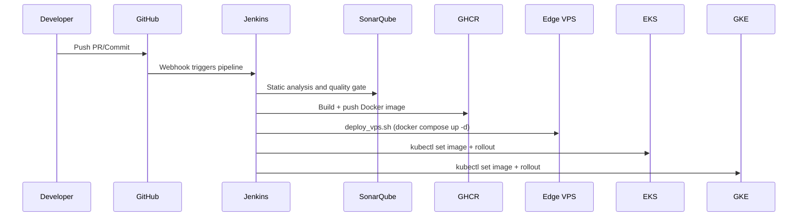

# Architecture

This project connects edge VPS nodes to on‑prem via IPsec (strongSwan ↔ SonicWALL), while also integrating small AWS EKS and GCP GKE clusters for scalable services. CI/CD via Jenkins builds and deploys to edge (Compose) and cloud (K8s), with SonarQube for code quality and SNMP for network monitoring.

Mermaid: High‑Level Topology

Mermaid: CI/CD Flow (Edge + Cloud)

Networking Notes
- Edge tunnels: each VPS establishes IKEv2 to SonicWALL; add routes for VPS subnets.
- On‑prem: static routes to AWS/GCP CIDRs via SonicWALL; OSPF/VLANs for internal segmentation.
- Cloud: standard north‑south via LBs; private nodes with NAT/Cloud NAT for egress.

Security
- IPsec AES‑256/IKEv2; least‑privilege for CI/CD credentials; restricted inbound to LBs.

Cost Levers
- Use low‑cost VPS for edge; Spot/Preemptible nodes in cloud clusters; schedule CI and consolidate infra.
